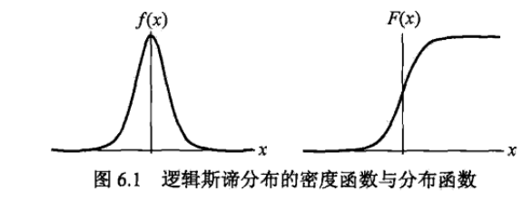

### 6.1.1 逻辑斯蒂分布 
&emsp;&emsp;定义6.1（逻辑斯谛分布）设 $X$ 是连续随机变量，$X$ 服从逻辑斯谛分布是指 $X$ 具有下列分布函数和密度函数： 
$$ F(x)=P(X\leqslant x)=\frac{1}{1+\mathrm{e}^{-(x-\mu)/\gamma}} \quad(6.1) \\ \quad\\
f(x)=F^{\prime}(x)=\frac{\mathrm e^{-(x-\mu)/\gamma}}{\gamma(1+\mathrm e^{-(x-{\mu})/\gamma})^{2}} \quad(6.2)$$

&emsp;&emsp;逻辑斯谛分布的密度函数 $f(x)$ 和分布函数 $F(x)$ 的图形如上图所示.分布函数属于逻辑斯谛函数,其图形是一条S形曲线(sigmoidcurve).该曲线以点 $( \mu  , \frac {1}{2} ) $为中心对称,即满足 $$F(-x+ \mu  )- \frac {1}{2} =-F(x- \mu  )+ \frac {1}{2} $$

### 6.1.2 二项逻辑斯谛回归模型

&emsp;&emsp; 二项逻辑斯谛回归模型（binomial logistic regression model）是一种分类模型， 由条件概率分布 $P(Y|X)$ 表示，形式为参数化的逻辑斯谛分布.这里，随机变量 $X$ 取值为实数，随机变量 $Y$ 取值为 $1$ 或 $0$. 我们通过监督学习的方法来估计模型参数 
$$ P(Y=1\mid x)={\frac{\exp(w\cdot x+b)}{1+e x p(w\cdot x+b)}} \\  P(Y=0\mid x)={\frac{1}{1+\exp(w\cdot x+b)}} $$

&emsp;&emsp;现在考查逻辑斯谛回归模型的特点.一个事件的几率(odds)是指该事件发生的概率与该事件不发生的概率的比值.如果事件发生的概率是 $p$，那么该事件的几率是 $\frac {p}{1-p} $ ,该事件的对数几率 ( log odds) 或  logit 函数是  $$\text{logit}(p) = \text{log} {\frac{p}{1-p}} $$ 

&emsp;&emsp;对逻辑斯谛回归而言,由式(6.5)与式(6.6)得
 $$\log {\frac {P(Y=1|x)}{1-P(Y=1|x)}} =w \cdot  x$$
&emsp;&emsp;这就是说,在逻辑斯谛回归模型中,输出 $Y=1$ 的对数几率是输入 $x$ 的线性函数或者说,输出 $Y=1$ 的对数几率是由输入 $x$ 的线性函数表示的模型,即逻辑斯谛回归模型。

### 6.1.3 模型参数估计
&emsp;&emsp;逻辑斯谛回归模型学习时,对于给定的训练数据集 $T=\{( x_{1} , y_{1} ),( x_{2} , y_{2} ), \cdots  ,( x_{N} , y_{N} )\}$, 其中, $x_{i}  \in   R^{n} , y_{i}  \in  \{0,1\},$ 可以应用极大似然估计法估计模型参数,从而得到逻辑斯谛回归模型。
&emsp;&emsp;设: $P(Y=1|x)= \pi  (x)$,$\quad P(Y=0|x)=1- \pi  (x)$
&emsp;&emsp;似然函数为：$$\prod\limits_{i=1}^N[\pi(x_i)]^{y_i}[1-\pi(x_i)]^{1-y_i}$$

&emsp;&emsp;对数似然函数为：
$$\begin{aligned}L(w)&=\sum_{i=1}^{N}[y_{i}\log\pi(x_{i})+(1-y_{i})\log(1-\pi(x_{i}))]\\ &=\sum_{i=1}^{N}\bigg[y_{i}\log\frac{\pi(x_{i})}{1-\pi(x_{i})}+\log(1-{\pi}(x_{i}))\bigg]\\ &=\sum_{i=1}^{N}\bigg[y_{i}(w\cdot x_{i})-\log(1+\exp(w\cdot x_{i})\bigg]\end{aligned} $$

&emsp;&emsp;对 $L(w)$ 求极大值,得到 $w$ 的估计值。
&emsp;&emsp;这样,问题就变成了以对数似然函数为目标函数的最优化问题。逻辑斯谛回归学习中通常采用的方法是梯度下降法及拟牛顿法假设 $w$ 的极大似然估计值是 $\hat {w} $，那么学到的逻辑斯谛回归模型为
$$ P(Y=1|x)=\dfrac{\exp(\hat{w}\cdot x)}{1+\exp(\hat w\cdot x)}\\ \quad \\ P(Y=0|x)=\dfrac{1}{1+\exp(\hat{w} \cdot x)} $$

&emsp;&emsp;
&emsp;&emsp;
&emsp;&emsp;
&emsp;&emsp;
&emsp;&emsp;
&emsp;&emsp;
&emsp;&emsp;
&emsp;&emsp;
&emsp;&emsp;